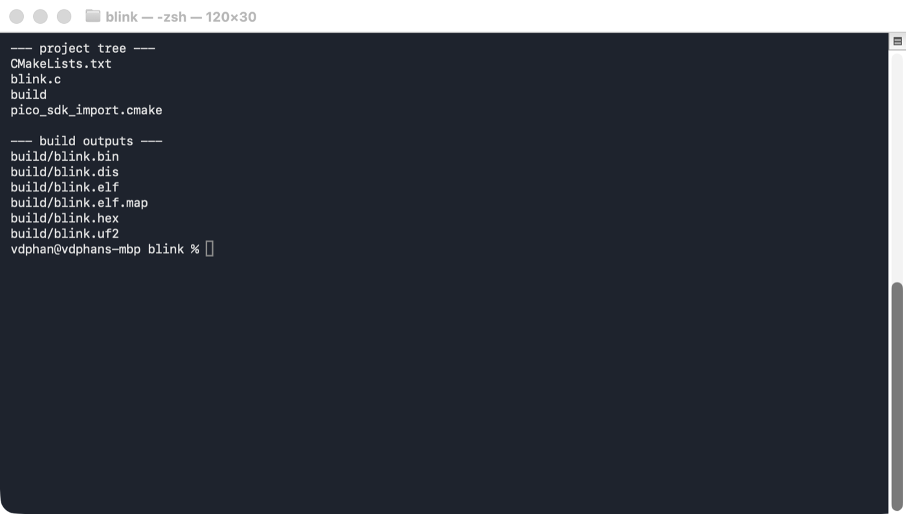
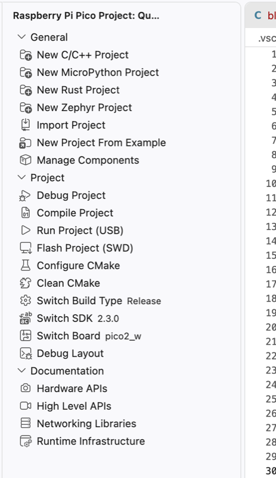
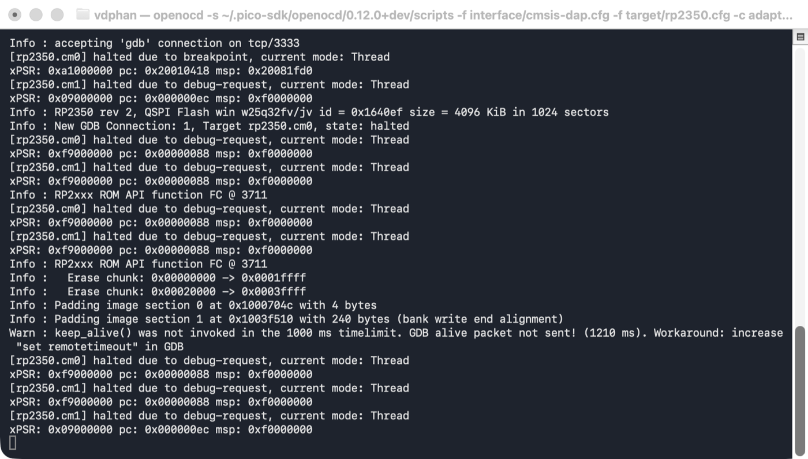
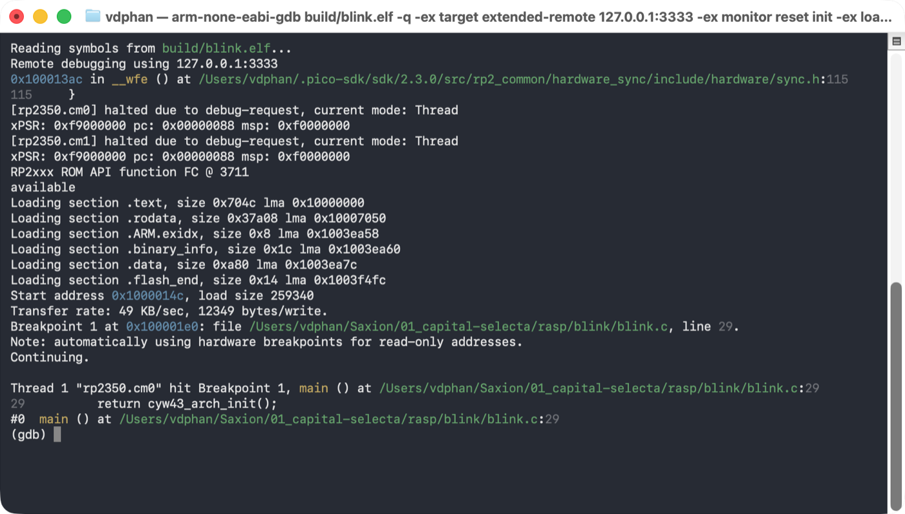
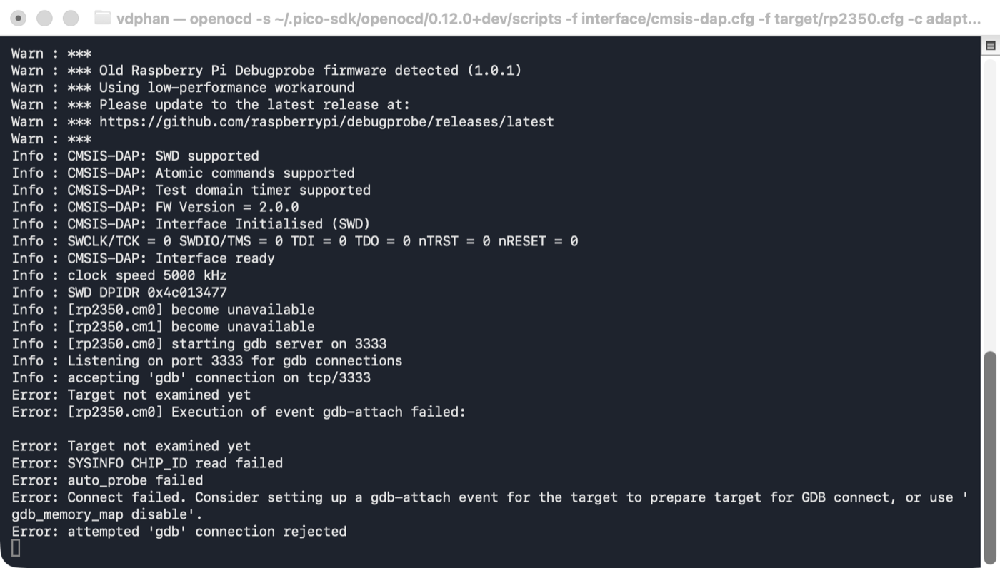
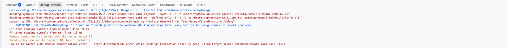

# Pico 2 W — `blink` project notes

Working notes for building, flashing and debugging a Raspberry Pi Pico 2 W
(RP2350) from macOS, using VS Code and a Raspberry Pi Debug Probe.

Everything here was verified on this machine against this board. Screenshots are
real output, including the failures.

**Hardware used**

| Item | Detail |
| --- | --- |
| Board | Pico 2 W — RP2350 rev 2, package A, 30 GPIO |
| Flash | Winbond W25Q32, 4 MiB, QSPI, XIP-mapped at `0x10000000` |
| WiFi/BT | CYW43439 |
| Probe | Raspberry Pi Debug Probe, USB `2E8A:000C`, CMSIS-DAP v2.0.0, firmware **1.0.1** |
| Probe UART | `/dev/cu.usbmodem114202` |
| Host | macOS on Apple silicon |

---

## 1. Project layout

```txt
rasp/blink/
├── CMakeLists.txt          build definition
├── pico_sdk_import.cmake   boilerplate that locates the SDK
├── blink.c                 the application
├── docs/images/            screenshots for this README
├── .vscode/                generated by the Pico extension
│   ├── launch.json         two debug configurations
│   ├── tasks.json          five build/flash tasks
│   ├── settings.json       toolchain paths, PICO_SDK_PATH
│   ├── c_cpp_properties.json   IntelliSense
│   ├── cmake-kits.json
│   └── extensions.json     recommended extensions
└── build/                  generated — safe to delete entirely
```



### The toolchain lives outside the project

The `raspberry-pi.raspberry-pi-pico` extension ignores Homebrew and installs a
private toolchain under `~/.pico-sdk/`:

| Path | Contents |
| --- | --- |
| `sdk/2.3.0` | Pico SDK sources |
| `toolchain/15_2_Rel1` | `arm-none-eabi-gcc` / `arm-none-eabi-gdb` |
| `toolchain/RISCV_PICO_2_3_0_1` | `riscv32-pico-elf-gcc` / `riscv32-pico-elf-gdb` |
| `openocd/0.12.0+dev` | OpenOCD patched for RP2350 |
| `picotool/2.3.0` | USB bootloader tool |
| `cmake/v4.3.4`, `ninja/v1.13.2` | build system |

> **Do not `brew install openocd`.** The Homebrew build predates RP2350 and will
> not recognise the chip. Same for `arm-none-eabi-gdb`.

`.vscode/settings.json` puts these on `PATH` **only inside VS Code's integrated
terminal**. In a normal shell, `PICO_SDK_PATH` is empty and `openocd` is not on
`PATH` — which is why the commands below use absolute paths.

### Build outputs

`pico_add_extra_outputs(blink)` in CMakeLists generates all of these:

| File | Size | Purpose |
| --- | --- | --- |
| `blink.elf` | 948 KB | **debug symbols — what GDB loads** |
| `blink.uf2` | 520 KB | drag-and-drop to the `RPI-RP2` volume |
| `blink.bin` | 259 KB | raw image |
| `blink.hex` | 730 KB | Intel HEX |
| `blink.elf.map` | 486 KB | symbol/section placement — read when flash overflows |
| `blink.dis` | 506 KB | full disassembly |

### Why "blink" is 271 KB

| Section | Size |
| --- | --- |
| `.text` (all code) | 28,748 B |
| `.rodata` | 227,848 B |
| `.data` | 2,688 B |

One symbol dominates:

```txt
w43439A0_7_95_49_00_combined    0x36fd8 = 225,240 bytes
```

That is the complete CYW43439 WiFi firmware image, compiled into the binary.
**The Pico 2 W has no LED on the RP2350** — the LED hangs off a GPIO on the WiFi
chip, so blinking it requires booting the WiFi chip, which requires carrying its
firmware in flash. 83% of this binary is a WiFi driver blob.

That single fact explains the shape of `blink.c`: every operation is wrapped in
`#if defined(PICO_DEFAULT_LED_PIN) / #elif defined(CYW43_WL_GPIO_LED_PIN)` so
the same source builds for a Pico, Pico W, Pico 2 and Pico 2 W.

---

## 2. Compile and run on the board

### The architecture decision comes first

RP2350 has **two Cortex-M33 cores and two Hazard3 RISC-V cores** on the same
die. You choose one pair at build time; the other pair stays dark. This choice
propagates into which compiler, which OpenOCD config, and which GDB you must
use — mismatch any of them and nothing works.

| Build (`PICO_PLATFORM`) | Compiler | OpenOCD target | GDB |
| --- | --- | --- | --- |
| `rp2350-arm-s` | `arm-none-eabi-gcc` | `target/rp2350.cfg` | `arm-none-eabi-gdb` |
| `rp2350-riscv` | `riscv32-pico-elf-gcc` | `target/rp2350-riscv.cfg` | `riscv32-pico-elf-gdb` |

Check which one is active:

```bash
file build/blink.elf
grep -E '^(PICO_PLATFORM|PICO_BOARD):' build/CMakeCache.txt
```

**Arm is the better default.** VS Code's Cortex-Debug integration is Arm-first,
and the Cortex-M33 exposes 8 hardware breakpoints and 4 watchpoints against the
Hazard3's 4 triggers.

### Route A - VS Code (recommended)

The extension sidebar carries every action you need:



| Button | Effect |
| --- | --- |
| **Compile Project** | ninja build into `build/` |
| **Run Project (USB)** | `picotool load -fx` — flash over USB, no probe |
| **Flash Project (SWD)** | flash through the Debug Probe |
| **Debug Project** | build, flash over SWD, halt at `main` |
| **Switch Board** | changes board **and** Arm/RISC-V toolchain |
| **Switch Build Type** | Release ↔ Debug |
| **Clean CMake** / **Configure CMake** | wipe and regenerate `build/` |

Steps:

1. Open this folder in VS Code.
2. Install the recommended extensions (`raspberry-pi.raspberry-pi-pico`,
   `marus25.cortex-debug`, `ms-vscode.cpptools`).
3. **Compile Project**.
4. **Flash Project (SWD)** to run, or **F5** to debug.

The status bar confirms the active configuration: `Pico SDK: 2.3.0`,
`Board: pico2_w`.

### Route B — Terminal

Build:

```bash
cd /link-to-directory/blink
~/.pico-sdk/ninja/v1.13.2/ninja -C build
```

Reconfigure from scratch (e.g. to switch to a Debug build):

```bash
~/.pico-sdk/cmake/v4.3.4/bin/cmake -B build -G Ninja \
  -DPICO_BOARD=pico2_w \
  -DPICO_PLATFORM=rp2350-arm-s \
  -DCMAKE_BUILD_TYPE=Debug .
```

Flash through the probe — OpenOCD alone, note the trailing `exit`:

```bash
~/.pico-sdk/openocd/0.12.0+dev/openocd \
  -s ~/.pico-sdk/openocd/0.12.0+dev/scripts \
  -f interface/cmsis-dap.cfg \
  -f target/rp2350.cfg \
  -c "adapter speed 5000" \
  -c "program build/blink.elf verify reset exit"
```

Expected tail: `** Verified OK **` then `** Resetting Target **`.

### Route C — no probe at all

Hold **BOOTSEL**, plug in USB, and copy the UF2 to the volume that mounts:

```bash
cp build/blink.uf2 /Volumes/RPI-RP2/
```

Or skip the button press if the firmware has USB stdio:

```bash
~/.pico-sdk/picotool/2.3.0/picotool/picotool load build/blink.uf2 -fx
```

### Serial output

Nothing appears on the console unless the program prints. Stock `blink.c` has no
`printf`, so an empty terminal is correct behaviour, not a fault.

To add output, put `stdio_init_all();` as the first line of `main()` and
`#include <stdio.h>` at the top. Stdio goes over UART by default (GP0 TX / GP1
RX at 115200) — which is exactly where the probe's `U` connector sits.

```bash
minicom -D /dev/cu.usbmodem114202 -b 115200
# or
screen /dev/cu.usbmodem114202 115200
```

Use `/dev/cu.*`, never `/dev/tty.*`. The latter blocks waiting for carrier
detect. In minicom the escape key is **Esc**, not Ctrl-A: quit with **Esc**
then **X**, settings with **Esc** then **O**. Set Hardware Flow Control to `No`
or you cannot type.

Prefer UART over USB stdio while debugging: a halted core stops servicing USB,
so USB-CDC output dies at every breakpoint, whereas UART keeps flowing.

---

## 3. Debugging

### Wiring

The probe has two 3-pin JST-SH sockets:

- **`D`** → the 3-pin debug header on the board edge. Keyed, only fits one way.
  Carries SWCLK / GND / SWDIO. **Required for debugging.**
- **`U`** → serial. Cross over: probe **TX → GP1**, probe **RX → GP0**, GND to
  GND. Optional, independent of debugging.

`D` carries **no power**. Power the board separately over its own USB-C or VSYS.

### ADC vs OpenOCD vs GDB

Two of these are debugging tools. One is not.

**ADC**: Analog-to-Digital Converter. A peripheral *inside* the RP2350 that
measures voltages. It has nothing to do with debugging; it sits at the same
level as I2C, SPI or PWM. On this board: 12-bit, ~500 ksps, GP26/27/28 =
ADC0/1/2, plus an internal temperature sensor on channel 4. GP29 is shared with
the WiFi chip and is not freely usable.

```c
#include "hardware/adc.h"
adc_init();
adc_gpio_init(26);
adc_select_input(0);
uint16_t raw = adc_read();          // 0..4095
float volts = raw * 3.3f / 4096;
```

The only place it meets the others: if a reading looks wrong, you use GDB to
break after `adc_read()` and inspect `raw`. ADC is the thing *being* debugged.

> If you meant **DAP** rather than ADC, that *is* part of the stack. See the
> layer diagram below. The similar names (DAP, CMSIS-DAP, SWD) are a common
> source of confusion.

**The stack**

```txt
┌─────────────────────────────────────────────┐
│  GDB          arm-none-eabi-gdb             │  on the Mac
│  "line 29 of blink.c", "variable rc"        │
└──────────────────┬──────────────────────────┘
                   │  GDB Remote Serial Protocol, TCP :3333
┌──────────────────┴──────────────────────────┐
│  OpenOCD                                    │  on the Mac
│  "halt cm0", "erase sector 0x10000"         │
└──────────────────┬──────────────────────────┘
                   │  CMSIS-DAP over USB
┌──────────────────┴──────────────────────────┐
│  Debug Probe   RP2040 + debugprobe firmware │  the dongle
└──────────────────┬──────────────────────────┘
                   │  SWD — 2 wires: SWCLK, SWDIO
┌──────────────────┴──────────────────────────┐
│  DAP  →  Cortex-M33 cores  →  ...  →  ADC   │  inside RP2350
└─────────────────────────────────────────────┘
```

| | Runs on | Knows about | Does **not** know |
| --- | --- | --- | --- |
| **GDB** | the Mac | your C source, symbols, types, stack frames | anything about RP2350 hardware |
| **OpenOCD** | the Mac | RP2350 silicon, flash algorithms, core control | your source code |
| **Debug Probe** | the dongle | nothing — it converts USB to SWD | everything else |
| **ADC** | inside the chip | analog voltages | nothing; it is a peripheral your code drives |

They are **not alternatives**. GDB has source intelligence and no hardware
access; OpenOCD has hardware access and no source intelligence. Source-level
debugging needs both. Flashing needs only OpenOCD, because flashing needs no
symbols.

OpenOCD listens on three ports: **3333** GDB remote, **4444** telnet (type
OpenOCD commands directly), **6666** Tcl. In GDB, the `monitor` prefix forwards
a command straight to OpenOCD — `monitor reset init` is the same command you
could type on port 4444.

### Pros and cons

**Debug Probe (SWD)**

| Pros | Cons |
| --- | --- |
| Breakpoints, single-step, variable inspection | extra hardware to buy and wire |
| Flash without touching BOOTSEL | needs correct arch-matched configs |
| Works on a crashed or halted target | old firmware is slow (see below) |
| Separate UART console on the same dongle | 4–8 hardware breakpoints only |
| Can recover a bricked board (`rp2350-rescue.cfg`) | |

**UF2 drag-and-drop**

| Pros | Cons |
| --- | --- |
| Zero setup, zero extra hardware | no debugging at all |
| Cannot be misconfigured | physical button press every time |
| | slow, manual |

**picotool over USB**

| Pros | Cons |
| --- | --- |
| Fast, scriptable, no button press with `-fx` | no debugging |
| No probe needed | needs working USB firmware on the target |

**printf debugging over UART**

| Pros | Cons |
| --- | --- |
| Shows timing and behaviour of running code | changes the timing you are measuring |
| Survives a halted core | needs a rebuild+reflash per change |
| No probe needed if you have a USB-serial adapter | no state inspection |

**VS Code / Cortex-Debug vs raw GDB**

| | Pros | Cons |
| --- | --- | --- |
| **VS Code** | one keypress, variables pane, SVD peripheral-register view, clickable stepping | hides what it is doing; harder to diagnose when it breaks |
| **Raw GDB** | full control, scriptable, works over SSH, transparent | verbose commands, steeper learning curve |

### Running a debug session by hand

**Terminal 1** — OpenOCD as a server. No `exit`, so it stays up:

```bash
~/.pico-sdk/openocd/0.12.0+dev/openocd \
  -s ~/.pico-sdk/openocd/0.12.0+dev/scripts \
  -f interface/cmsis-dap.cfg \
  -f target/rp2350.cfg \
  -c "adapter speed 5000"
```



**Terminal 2** — GDB. Enter commands **one line at a time**:

```bash
cd /link-to-directory/blink
~/.pico-sdk/toolchain/15_2_Rel1/bin/arm-none-eabi-gdb build/blink.elf
```

```txt
target extended-remote 127.0.0.1:3333
monitor reset init
load
break main
continue
```



```txt
Thread 1 "rp2350.cm0" hit Breakpoint 1, main () at blink.c:29
29          return cyw43_arch_init();
```

Use `127.0.0.1`, not `localhost` — OpenOCD binds IPv4 only, and if `localhost`
resolves to `::1` first the connection is refused.

Useful commands: `next`, `step`, `finish`, `continue`, `info locals`,
`print var`, `bt`, `info registers`, `x/16xw 0x40028000`, `info breakpoints`,
`delete N`, `monitor reset halt`, `detach`.

Finish with `detach` then `quit`, not by killing the process — otherwise
OpenOCD holds a stale connection and the next session is refused.

### Debug builds

The default is `-O3`, so `print rc` returns `<optimized out>` and stepping
jumps around. For real debugging, reconfigure with `-DCMAKE_BUILD_TYPE=Debug`,
or use **Switch Build Type** in the extension sidebar.

---

## 4. Failures seen on this setup, and their fixes

### Cortex-M33 cores "become unavailable"



```txt
Info : [rp2350.cm0] become unavailable
Info : [rp2350.cm1] become unavailable
Error: Target not examined yet
Error: attempted 'gdb' connection rejected
```

**Cause.** RP2350 latches an `ARCHSEL` register selecting Arm or RISC-V. Once a
RISC-V session sets it, **the Arm cores do not exist** — and it survives reset.
So an Arm build cannot be debugged until the chip is switched back.

**Fix.** Write `ARCHSEL` via the RISC-V core, which is the one currently alive:

```bash
OCD=~/.pico-sdk/openocd/0.12.0+dev
$OCD/openocd -s $OCD/scripts \
  -c "set USE_CORE { cm0 cm1 rv0 rv1 }" \
  -f interface/cmsis-dap.cfg -f target/rp2350.cfg \
  -c "adapter speed 5000; init" \
  -c "targets rp2350.rv0; halt; write_memory 0x40120158 8 { 0x0 }" \
  -c "reset halt; exit"
```

Verify — you should now see `Cortex-M33 r1p0 processor detected`:

```bash
$OCD/openocd -s $OCD/scripts -f interface/cmsis-dap.cfg \
  -f target/rp2350.cfg -c "adapter speed 5000" -c "init; targets; exit"
```

`.vscode/tasks.json` has a **RISC-V Reset (RP2350)** task that does the reverse
(writes `0x3` to select RISC-V).

### VS Code debug fails with "Connection reset by peer"



```txt
Failed to launch GDB: Remote communication error.
Target disconnected: error while reading: Connection reset by peer.
(from target-select extended-remote localhost:3333)
```

**Causes, in order of likelihood:**

1. **A hand-started OpenOCD is already on port 3333.** The `Pico Debug
   (Cortex-Debug)` config spawns its own. Kill the old one first:

   ```bash
   pkill -f openocd
   ```

   Or use `Pico Debug (Cortex-Debug with external OpenOCD)` to attach to yours.
2. **The running OpenOCD uses the wrong target config** for the built
   architecture — e.g. a RISC-V OpenOCD serving an Arm ELF. That was the actual
   cause here.
3. The chip is in the wrong `ARCHSEL` mode — see above.

### `cannot resolve name: nodename nor servname provided`

Pasting several GDB commands at once. GDB reads the whole blob as the hostname
argument to `target extended-remote`. Enter one line at a time, or use a command
file with `-x`.

### `Cannot insert hardware breakpoint N`

Architecture mismatch between GDB/OpenOCD and the ELF, or you exceeded the
hardware breakpoint count. Code runs from flash, which GDB cannot rewrite, so
every breakpoint consumes a hardware trigger: **8 on Cortex-M33, 4 on Hazard3**.
The failure appears at `continue`, not at `break`, which makes it confusing.
Check with `info breakpoints`, free one with `delete N`.

### Slow flashing — 45 KB/sec

```txt
Warn : *** Old Raspberry Pi Debugprobe firmware detected (1.0.1)
Warn : *** Using low-performance workaround
```

Firmware 1.0.1 lacks the bulk-transfer command set, so OpenOCD falls back to one
transaction at a time. **Fix:** unplug the probe, hold its BOOTSEL button while
replugging, then copy a current `debugprobe.uf2` onto the `RPI-RP2` volume that
appears. Get it from
<https://github.com/raspberrypi/debugprobe/releases/latest>.

### `minicom: cannot open /dev/tty.usbmodemXXXXXXX`

Wrong device name, or the `tty.` variant. Find it with `ls /dev/cu.usbmodem*`
and use the `cu.` form.

### Serial console shows nothing

Usually correct: stock `blink.c` prints nothing. Add `stdio_init_all()` and a
`printf`. Stray characters on an otherwise silent line are noise from a floating
RX pin.

---

## Quick reference

```bash
# paths
OCD=~/.pico-sdk/openocd/0.12.0+dev
GDB=~/.pico-sdk/toolchain/15_2_Rel1/bin/arm-none-eabi-gdb   # Arm build
# GDB=~/.pico-sdk/toolchain/RISCV_PICO_2_3_0_1/bin/riscv32-pico-elf-gdb   # RISC-V build

# build
~/.pico-sdk/ninja/v1.13.2/ninja -C build

# flash and go
$OCD/openocd -s $OCD/scripts -f interface/cmsis-dap.cfg -f target/rp2350.cfg \
  -c "adapter speed 5000" -c "program build/blink.elf verify reset exit"

# debug server
$OCD/openocd -s $OCD/scripts -f interface/cmsis-dap.cfg -f target/rp2350.cfg \
  -c "adapter speed 5000"

# serial console
screen /dev/cu.usbmodem114202 115200

# what am I building?
file build/blink.elf

# who is holding the probe / port 3333?
pgrep -fl openocd ; lsof -nP -iTCP:3333 -sTCP:LISTEN
```

---

## 5. Debugging inside VS Code

The command-line workflow above is what to fall back on when things break. This
is the day-to-day one.

### Prerequisites

| Requirement | Check |
| --- | --- |
| Probe `D` cable seated, board powered separately | `ioreg -p IOUSB -l -w 0 \| grep "Debug Probe"` |
| Extensions installed | `raspberry-pi.raspberry-pi-pico`, `marus25.cortex-debug` |
| **No** hand-started OpenOCD running | `pgrep -fl openocd` → should be empty |
| Launch config = **`Pico Debug (Cortex-Debug)`** | Run and Debug dropdown |
| Build type = **Debug** | see below |

Cortex-Debug launches its own OpenOCD on **ports 50000/50001/50002**, not 3333.
That is why it does not collide with a manual server on the default port — but
it *does* collide over the USB probe itself, so only one may run at a time.

### Build Debug, not Release

At `-O3` the compiler deletes variables, merges lines and reorders code. You set
a breakpoint on line 48 and land on line 50; locals read `<optimized out>`. Most
"the debugger is lying to me" moments are this.

**Pico sidebar → Switch Build Type → Debug**, then **Compile Project**. Or:

```bash
~/.pico-sdk/cmake/v4.3.4/bin/cmake -B build -DCMAKE_BUILD_TYPE=Debug .
~/.pico-sdk/ninja/v1.13.2/ninja -C build
```

Confirm the flags actually changed to `-Og -g`:

```bash
python3 -c "
import json,re
d=json.load(open('build/compile_commands.json'))
for e in d:
    if e['file'].endswith('blink.c'):
        print([x for x in e['command'].split() if re.match(r'^-O|^-g',x)]); break
"
```

Debug builds are larger — `.text` grows from ~29 KB to ~266 KB for this project,
because SDK functions are no longer inlined away.

### Toolbar

| Button | Key | Effect |
| --- | --- | --- |
| Continue / Pause | **F5** | run to next breakpoint |
| Step Over | **F10** | execute this line, don't enter calls |
| Step Into | **F11** | descend into the call on this line |
| Step Out | **Shift+F11** | run until the current function returns |
| Restart | **Cmd+Shift+F5** | `monitor reset init` + reload |
| Stop | **Shift+F5** | detach **and kill OpenOCD** |

On `int rc = pico_led_init();` — **F10** runs the entire WiFi bring-up and moves
to the next line. **F11** descends into `pico_led_init`, then `cyw43_arch_init`,
then the SDK's SPI transfers.

### Breakpoints

| Kind | How | Use |
| --- | --- | --- |
| Plain | click the gutter | stop every time |
| Conditional | right-click gutter → *Add Conditional Breakpoint* → `led_on == true` | stop only when it matters |
| Hit count | right-click gutter → *Hit Count* → `> 10` | skip early iterations |
| Logpoint | right-click gutter → *Add Logpoint* → `LED is now {led_on}` | print **without halting** |

Logpoints are `printf` debugging with no rebuild, no reflash and no UART wiring.
For timing-sensitive code, where halting changes the behaviour being chased,
they are often the only thing that works.

**Limit: 8 hardware breakpoints on Cortex-M33** (4 on Hazard3 RISC-V). Code runs
from flash, which GDB cannot rewrite, so every breakpoint consumes a hardware
trigger. The 9th fails at `continue`, not when you set it. Uncheck entries in
the **Breakpoints** panel rather than deleting them.

### Inspecting state

- **Hover** over a variable while stopped — fastest path to a value.
- **Variables** panel — `Locals` and `Registers`. **Values are editable**:
  double-click, type, Enter, and the write goes to the target. Forcing a value
  to test a branch beats rebuilding.
- **Watch** panel — persistent expressions across steps and sessions:

  ```c
  led_on
  rc
  *(volatile uint32_t*)0x40028000
  ```

- **Cortex Live Watch** — polls values **while the target runs**, without
  halting. Watch a counter increment in real time.

### Call Stack and the two cores

```txt
rp2350.cm0   state: breakpoint     ← your code
rp2350.cm1   state: debug-request  ← idle; blink is single-core
```

Click any frame to switch context — the editor jumps there and Variables
repopulates for that frame. Walking up from a nested SDK function to `main` is
how you find who called what with which arguments.

### Peripheral register viewer

The single best reason to debug in the IDE. `launch.json` points `svdFile` at
`~/.pico-sdk/sdk/2.3.0/src/rp2350/hardware_regs/RP2350.svd`, which gives the
**XPeripherals** / Cortex Peripherals panel every peripheral by name —
`IO_BANK0`, `SIO`, `UART0`, `ADC`, `CLOCKS`, `PWM` — expandable to individual
**named, decoded bit fields**.

Rather than recalling that `0x400140cc` bit 5 is the pull-up enable, expand
`PADS_BANK0 → GPIO25 → PUE`. Fields are writable, so you can poke hardware
without recompiling. When a driver misbehaves, this shows what the silicon
actually thinks its configuration is versus what you believe you configured.

### Memory and disassembly

- **Memory:** Cmd+Shift+P → *Cortex-Debug: View Memory* → an address such as
  `0x20000000`. Live hex dump.
- **Disassembly:** right-click in the editor → *Open Disassembly View*. Stepping
  becomes instruction-by-instruction. Go here when the C source and the observed
  behaviour disagree.

### The Debug Console is a full GDB prompt

Prefix with `-exec`:

```txt
-exec info registers
-exec x/16xw 0x40028000
-exec info breakpoints
-exec p/x $pc
-exec monitor reset halt
```

`-exec monitor ...` reaches OpenOCD itself. The IDE adds panels on top of GDB;
it never takes anything away. When a GUI feature misbehaves, drop to `-exec`.

### Exercise — step an LED by hand

1. Debug build, recompiled.
2. Breakpoint on **line 48**, `pico_set_led(true);`
3. **F5** — stops there.
4. Add `led_on` to **Watch**.
5. **F10** twice — the physical LED turns on as you step past line 48.
6. **F11** on line 48 — descend into `pico_set_led`, then
   `cyw43_arch_gpio_put`, and see the SPI transaction to the WiFi chip.
7. Make the breakpoint conditional on `led_on == false` — now it stops only on
   the off-transition.
8. Open **XPeripherals**, find `SIO`, and watch registers change as you step.

### Gotchas

| Symptom | Cause / fix |
| --- | --- |
| `could not connect: Operation timed out` | `Pico Debug (Cortex-Debug with external OpenOCD)` selected but no server running. Switch to plain `Pico Debug (Cortex-Debug)`, or start OpenOCD yourself |
| `Connection reset by peer` | a server is there but wrong — wrong arch config, or cores unavailable. `pkill -f openocd` and let VS Code launch its own |
| Locals show `<optimized out>` | Release build — switch to Debug |
| Breakpoint lands on the wrong line | Release build — switch to Debug |
| 9th breakpoint silently fails | 8 hardware triggers max on Cortex-M33 |
| `Problems: 78` in the status bar | IntelliSense noise, unrelated to debugging |
| "Some content has been disabled in this document" in a Markdown preview | VS Code blocks local images. Preview `...` menu → *Change Preview Security Settings* → *Allow insecure content* |
| Debug works, then stops working after Shift+F5 | Stop kills OpenOCD. Start a server again before hand-running GDB |

---

## 6. Build failures after switching board or architecture

### `ninja: error: loading 'CMakeFiles/rules.ninja': No such file or directory`

```txt
ninja: Entering directory `build'
ninja: error: build.ninja:35: loading 'CMakeFiles/rules.ninja': No such file or directory
```

**This error is a symptom, not the cause.** It appears after **Clean CMake**,
which wipes `CMakeFiles/` but leaves `build.ninja` and `CMakeCache.txt` behind.
Re-running the configure step then exposes whatever was already wrong.

The underlying fault is usually a **half-completed toolchain switch** in
`CMakeCache.txt`. CMake caches compiler paths on the first configure and never
re-checks them, so switching board or architecture can leave a mixture:

```txt
CMAKE_ASM_COMPILER  .../toolchain/15_2_Rel1/bin/arm-none-eabi-gcc        ← Arm
CMAKE_C_COMPILER    .../toolchain/RISCV_PICO_2_3_0_1/bin/riscv32-...-gcc ← RISC-V
CMAKE_CXX_COMPILER  .../toolchain/RISCV_PICO_2_3_0_1/bin/riscv32-...-g++ ← RISC-V
PICO_PLATFORM       rp2350-arm-s                                         ← Arm
PICO_TOOLCHAIN_PATH .../toolchain/15_2_Rel1                              ← Arm
```

This stays invisible while object files exist — ninja just relinks them. Once
`CMakeFiles/` is cleaned, CMake re-detects the compiler and the contradiction
surfaces:

```txt
riscv32-pico-elf-gcc  -mcpu=cortex-m33 -mthumb -march=armv8-m.main+fp+dsp
riscv32-pico-elf-gcc: error: unrecognized command-line option '-mthumb'
riscv32-pico-elf-gcc: error: '-march=armv8-m.main+fp+dsp': ISA string must begin with rv32
```

A RISC-V compiler receiving Arm flags.

**Diagnose** — all three must point at the same toolchain directory:

```bash
grep -E "^CMAKE_(C|CXX|ASM)_COMPILER:" build/CMakeCache.txt
```

**Fix — delete `build/` entirely.** "Clean CMake" is not enough, because it
leaves `CMakeCache.txt`, which is exactly where the stale paths live.

```bash
cd /1.unit-testing/blink
rm -rf build
~/.pico-sdk/cmake/v4.3.4/bin/cmake -B build -G Ninja \
  -DCMAKE_BUILD_TYPE=Debug \
  -DPICO_BOARD=pico2_w \
  -DPICO_PLATFORM=rp2350-arm-s .
~/.pico-sdk/ninja/v1.13.2/ninja -C build
```

A healthy configure names the toolchain consistently:

```txt
Pico Platform (PICO_PLATFORM) is 'rp2350-arm-s'.
Detected GCC so defaulting PICO_COMPILER to `pico_arm_cortex_m33_gcc`
Build type is Debug
Using regular optimized debug build (set PICO_DEOPTIMIZED_DEBUG=1 to de-optimize)
```

> **Rule: after switching board or architecture, `rm -rf build`.** Do not rely
> on Clean CMake.

### Still seeing `<optimized out>` in a Debug build

`CMAKE_BUILD_TYPE=Debug` gives `-Og -g` — optimized but debuggable. If a
variable is still elided or stepping still jumps, force `-O0`:

```bash
rm -rf build
~/.pico-sdk/cmake/v4.3.4/bin/cmake -B build -G Ninja \
  -DCMAKE_BUILD_TYPE=Debug -DPICO_DEOPTIMIZED_DEBUG=1 \
  -DPICO_BOARD=pico2_w -DPICO_PLATFORM=rp2350-arm-s .
~/.pico-sdk/ninja/v1.13.2/ninja -C build
```

Larger and slower — use it only when `-Og` is hiding something.

### Verify a build before debugging

```bash
file build/blink.elf                                  # ARM vs RISC-V
grep -E '^CMAKE_BUILD_TYPE:|^PICO_PLATFORM:' build/CMakeCache.txt
python3 -c "
import json,re
d=json.load(open('build/compile_commands.json'))
for e in d:
    if e['file'].endswith('blink.c'):
        print('flags:',[x for x in e['command'].split() if re.match(r'^-O|^-g',x)]); break
"
```

Expected for a debuggable Arm build: `ELF 32-bit LSB executable, ARM`,
`CMAKE_BUILD_TYPE:STRING=Debug`, `PICO_PLATFORM:STRING=rp2350-arm-s`,
`flags: ['-Og', '-g']`.
