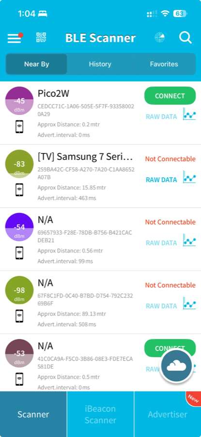
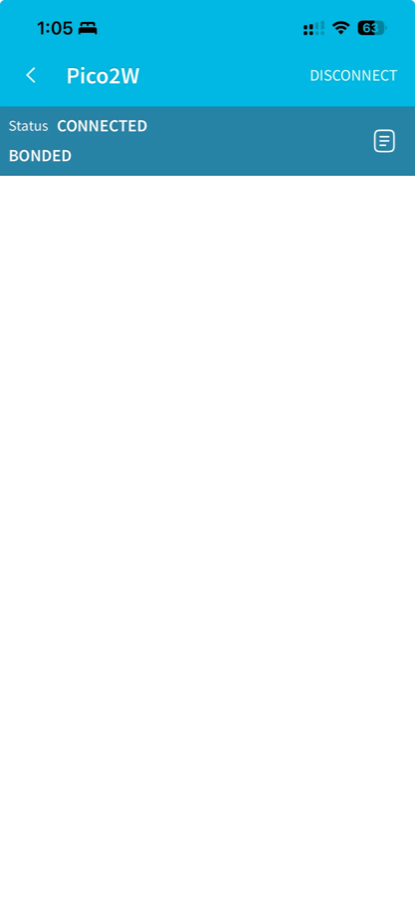

# Pico 2 W — `bluetooth`

A Bluetooth Low Energy **scanner and advertiser**. Brings up the CYW43439's
Bluetooth radio through BTstack, then does two things at once:

- **advertises** as `Pico2W`, so phones and other devices can see it
- **scans** for nearby BLE advertisements, printing address, RSSI and name

Built on macOS with VS Code, the Raspberry Pi Pico extension, and a Raspberry Pi
Debug Probe. Verified on real hardware.

Scanning alone is invisible from the outside — a scanner only listens, and
transmits nothing. Advertising is what makes the board appear on a phone. The
two are independent roles and this project runs both.

## Result

### Discovered from a phone



The board advertises as **`Pico2W`** and appears at the top of the list at
**-45 dBm** (roughly 0.2 m away), marked **CONNECT** — connectable, because
`ADV_IND` was used. Everything below it is ordinary background BLE traffic: a
Samsung TV at -83 dBm, and several `N/A` entries that advertise no name.

Two details in that list are worth reading:

- **`Advert. interval: 0 ms`** on the Pico means the app has not yet measured a
  gap between advertisements — our 30 ms interval is faster than its sampling.
- The identifier shown is a **CoreBluetooth UUID**, not a MAC address. iOS never
  exposes hardware Bluetooth addresses to apps; it substitutes a per-device,
  per-app identifier. The same board will show a different UUID on another
  phone.

### Connected



**Status: CONNECTED, BONDED.** The link was established and the security
manager completed pairing — `sm_init()` in `main()` is what makes bonding
possible.

The service list below is **empty, and that is expected**: this firmware
advertises and accepts connections, but implements no GATT services, so there
are no characteristics to read or write. Adding a GATT server is the natural
next step (see below).

### Console output

```
Starting Bluetooth...
Bluetooth ready. Local address: 98:FE:54:XX:XX:XX
Advertising as 'Pico2W' — look for it in a BLE scanner app.
Scanning for BLE devices...

[  1] 4C:87:5D:1A:3F:22  RSSI  -67 dBm  (no name)
[  2] 71:0B:E9:44:82:C1  RSSI  -81 dBm  Galaxy Buds
[  3] 60:AB:D2:0E:55:97  RSSI  -55 dBm  (no name)
...
```

Verified with the debugger while the firmware ran free:

```
(gdb) backtrace
#20 btstack_run_loop_async_context_execute () at btstack_run_loop_async_context.c:86
#21 btstack_run_loop_execute () at btstack_run_loop.c:310
#22 main () at bluetooth.c:115
(gdb) print report_count
$1 = 1006
(gdb) print adv_data
$2 = "\002\001\006\a\tPico2W"
```

1006 advertising reports processed, and the advertising payload decodes as
`02 01 06` (flags) then `07 09 "Pico2W"` (complete local name).

Most BLE devices use randomised, rotating addresses for privacy, so the same
physical phone or watch appears repeatedly under different addresses. A busy
room produces hundreds of reports per minute.

## Hardware

| Item | Detail |
| --- | --- |
| Board | Pico 2 W — RP2350 + CYW43439 (WiFi **and** Bluetooth) |
| Bluetooth | BLE and Classic, via BTstack; shares the SPI bus with WiFi |
| Probe | Raspberry Pi Debug Probe — `D` → debug header, `U` → GP0/GP1 |
| Console | `/dev/cu.usbmodem114202` @ 115200 |

## Project layout

```
rasp/bluetooth/
├── CMakeLists.txt        build definition
├── bluetooth.c           the scanner
├── btstack_config.h      BTstack configuration — REQUIRED
├── pico_sdk_import.cmake
├── .vscode/
└── build/                generated
```

## Setup

### 1. Board and console

Same as any Pico 2 W project:

| Setting | Value |
| --- | --- |
| **Board type** | **Pico 2 W** — plain "Pico 2" has no radio at all |
| Architecture | Arm (leave the RISC-V box unchecked) |
| **Stdio** | **Console over UART** — matches the probe's `U` connector |

### 2. CMakeLists.txt — link BTstack

```cmake
target_link_libraries(bluetooth
    pico_stdlib
    pico_btstack_ble       # BTstack Bluetooth Low Energy
    pico_btstack_cyw43     # BTstack <-> CYW43439 HCI transport
    pico_cyw43_arch_none   # CYW43 driver, no lwIP
)

target_include_directories(bluetooth PRIVATE ${CMAKE_CURRENT_LIST_DIR})
```

Choosing the right BTstack libraries:

| Library | Use |
| --- | --- |
| **`pico_btstack_ble`** | **Bluetooth Low Energy — use this** |
| `pico_btstack_classic` | Classic Bluetooth (A2DP, SPP, HFP) |
| `pico_btstack_cyw43` | **required** — the HCI transport to the chip |
| `pico_btstack_flash_bank` | persistent pairing keys in flash |

`pico_cyw43_arch_none` is correct here: BLE does **not** go through lwIP, so no
TCP/IP stack is needed. Add `pico_cyw43_arch_lwip_threadsafe_background` instead
only if the same program also uses WiFi.

### 3. btstack_config.h — required, not optional

**BTstack ships no default configuration.** Every project must supply this
header, exactly like lwIP's `lwipopts.h`. Without it the build fails at the
first BTstack include.

Key entries in [btstack_config.h](btstack_config.h):

| Define | Why |
| --- | --- |
| `ENABLE_LE_CENTRAL` | we scan for peripherals. An advertiser needs `ENABLE_LE_PERIPHERAL` |
| `MAX_NR_CONTROLLER_ACL_BUFFERS 3` | keeps the stack from overrunning the CYW43 shared SPI bus |
| `ENABLE_HCI_CONTROLLER_TO_HOST_FLOW_CONTROL` | same reason — the bus is shared with WiFi |
| `HAVE_EMBEDDED_TIME_MS`, `HAVE_ASSERT` | maps BTstack's HAL onto the Pico SDK |
| `MAX_ATT_DB_SIZE 512` | BTstack gets no `malloc`, so the ATT database is fixed-size |

The bus-related settings matter on this board specifically: WiFi and Bluetooth
share one SPI link to the CYW43439, and an unthrottled BTstack can swamp it.

## How the code works

BTstack is **event-driven**. There is no `bt_connect()` you call and wait on —
you register a callback and react to what arrives.

```c
hci_event_callback_registration.callback = &packet_handler;
hci_add_event_handler(&hci_event_callback_registration);
hci_power_control(HCI_POWER_ON);
btstack_run_loop_execute();          // never returns
```

Two events carry the work:

**`BTSTACK_EVENT_STATE`** — fires when the controller finishes initialising.
Scanning can only start once it reports `HCI_STATE_WORKING`:

```c
if (btstack_event_state_get_state(packet) == HCI_STATE_WORKING) {
    gap_set_scan_parameters(0 /* passive */, SCAN_INTERVAL, SCAN_WINDOW);
    gap_start_scan();
}
```

`gap_set_scan_parameters(type, interval, window)` — type `0` is a *passive*
scan: listen only, never ask devices for more data. Interval and window are in
0.625 ms units; setting them equal (`0x0030` = 30 ms) means listen continuously.

**`GAP_EVENT_ADVERTISING_REPORT`** — one per advertisement heard. Address and
RSSI come from accessors; the name has to be parsed out of the payload, because
advertising data is a packed sequence of length-type-value records:

```c
ad_context_t context;
for (ad_iterator_init(&context, data_len, data);
     ad_iterator_has_more(&context);
     ad_iterator_next(&context)) {
    uint8_t type = ad_iterator_get_data_type(&context);
    if (type == BLUETOOTH_DATA_TYPE_COMPLETE_LOCAL_NAME || ...) { ... }
}
```

Most devices advertise no name — `(no name)` in the output is normal, not a bug.

`l2cap_init()` and `sm_init()` are called even though a passive scan uses
neither directly; BTstack expects both layers present before `HCI_POWER_ON`.

## Build and flash

From the IDE: **Compile Project**, then **Flash Project (SWD)**.

From the terminal:

```bash
cd /1.unit-testing/bluetooth

~/.pico-sdk/cmake/v4.3.4/bin/cmake -B build -G Ninja \
  -DCMAKE_BUILD_TYPE=Debug -DPICO_BOARD=pico2_w -DPICO_PLATFORM=rp2350-arm-s .

~/.pico-sdk/ninja/v1.13.2/ninja -C build

~/.pico-sdk/openocd/0.12.0+dev/openocd \
  -s ~/.pico-sdk/openocd/0.12.0+dev/scripts \
  -f interface/cmsis-dap.cfg -f target/rp2350.cfg \
  -c "adapter speed 5000" \
  -c "program build/bluetooth.elf verify reset exit"
```

## Serial Monitor

**Panel → Serial Monitor:**

| Setting | Value |
| --- | --- |
| Port | `/dev/tty.usbmodem114202 - Raspberry Pi` |
| Baud rate | `115200` |
| Line ending | `None` |

Only one program may hold a serial port. If `screen` or `minicom` has it, the
Serial Monitor reports `Failed to open the serial port`:

```bash
lsof /dev/cu.usbmodem114202 /dev/tty.usbmodem114202
screen -ls && screen -X -S <pid> quit
```

### When the Serial Monitor stops updating

A scanner produces output continuously, and the Serial Monitor view can freeze
while still consuming data. Confirm which it is:

```bash
lsof /dev/tty.usbmodem114202
```

A **growing** offset (the `0t…` column) across successive calls means bytes are
arriving and the *view* is stuck — click **Stop Monitoring**, then **Start
Monitoring**. A static offset means nothing is being sent.

To rule out the console entirely, check the firmware itself through the
debugger:

```bash
~/.pico-sdk/toolchain/15_2_Rel1/bin/arm-none-eabi-gdb build/bluetooth.elf -q -batch \
  -ex "target extended-remote 127.0.0.1:3333" \
  -ex "monitor halt" -ex "backtrace" -ex "print report_count"
```

A rising `report_count` proves the scan is running regardless of what the
console shows.

## Troubleshooting

| Symptom | Cause and fix |
| --- | --- |
| `btstack_config.h: No such file` | supply the file; BTstack has no defaults |
| `undefined reference to hci_power_control` | missing `pico_btstack_ble` |
| `undefined reference to hci_transport_cyw43_instance` | missing `pico_btstack_cyw43` |
| `pico/cyw43_arch.h` not found | `PICO_BOARD` is `pico2`, not `pico2_w` |
| No advertising reports at all | `ENABLE_LE_CENTRAL` missing from the config |
| Board not visible from a phone | `ENABLE_LE_PERIPHERAL` missing, or you are looking in iOS Settings instead of a BLE scanner app |
| Hangs after `Starting Bluetooth...` | `cyw43_arch_init()` failed — check the board is a W variant |
| Console frozen | see the Serial Monitor section above |
| `clang: error: unsupported argument 'armv8-m.main+fp+dsp'` | CMake cached the host compiler — `rm -rf build` and reconfigure |

BLE addresses are mostly **random and rotating** by design. Seeing the same
device under many addresses is privacy behaviour working as intended, not a
fault in the scanner.

## Making the Pico visible to a phone

**Scanning and advertising are opposite roles.** An LE *central* listens and
transmits nothing, so it cannot be discovered. To appear on a phone, the board
must act as an LE *peripheral* and broadcast.

Two things are required.

`btstack_config.h`:

```c
#define ENABLE_LE_CENTRAL      // scan for others
#define ENABLE_LE_PERIPHERAL   // ...and be discoverable ourselves
```

And an advertising payload, which is the same length-type-value format as
received advertising data:

```c
static uint8_t adv_data[] = {
    0x02, BLUETOOTH_DATA_TYPE_FLAGS, 0x06,          // LE General Discoverable
    sizeof(DEVICE_NAME), BLUETOOTH_DATA_TYPE_COMPLETE_LOCAL_NAME,
    'P','i','c','o','2','W',
};

gap_advertisements_set_params(0x0030, 0x0030, 0 /* ADV_IND */,
                              0, null_addr, 0x07, 0x00);
gap_advertisements_set_data(sizeof(adv_data), adv_data);
gap_advertisements_enable(1);
```

The length byte counts the type byte plus the value, but not itself. `ADV_IND`
means connectable and undirected — the ordinary "anyone may find and connect to
me" mode. `0x07` advertises on all three primary channels.

Verify from the debugger that the payload is well formed:

```txt
(gdb) print adv_data
$1 = "\002\001\006\a\tPico2W"
```

That decodes as `02 01 06` (flags) then `07 09 "Pico2W"` (complete local name).

### iOS Settings will not show it

**Settings → Bluetooth on an iPhone does not list bare BLE peripherals.** That
screen shows Classic Bluetooth devices and BLE devices offering recognised
pairing profiles — keyboards, headphones, watches. A generic advertiser is
filtered out.

Use a BLE scanner app instead:

| App | Notes |
| --- | --- |
| **nRF Connect** (Nordic) | free; shows raw advertising data |
| **LightBlue** (Punch Through) | free; simpler |

`Pico2W` appears there with its RSSI, and tapping **CONNECT** establishes a
link that reaches `CONNECTED / BONDED` — see the screenshots at the top of this
file. The service list stays empty because there are no GATT services behind it
yet; add a GATT server for something to read.

Running both roles at once is legal in BLE and the CYW43439 supports it, but the
radio time-slices between them, so scan reports arrive slightly more slowly than
in a scan-only build.

## Next steps

- **GATT server** — expose a value such as the RP2350's internal temperature.
  Needs a `.gatt` file compiled by `pico_btstack_make_gatt_header`.
- **Filter the scan** to a single address or name, to cut the noise.
- **De-duplicate** by address so each device prints once.
