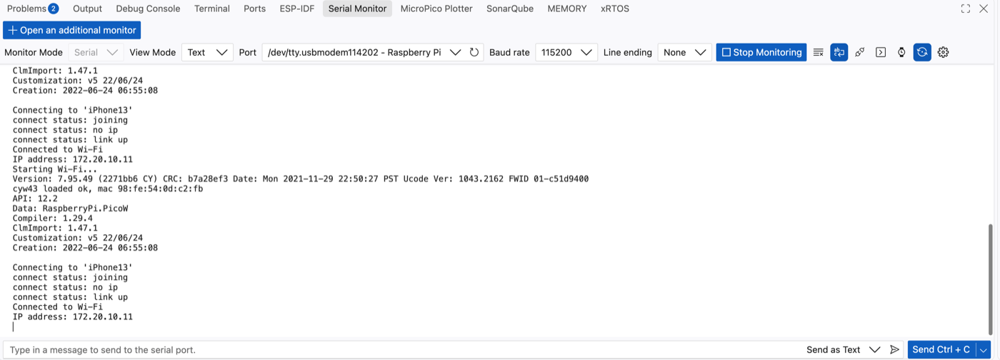
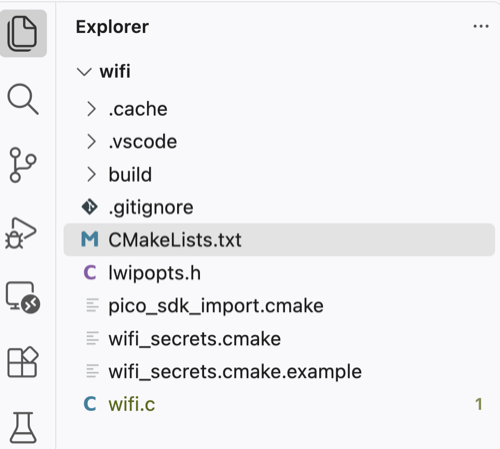
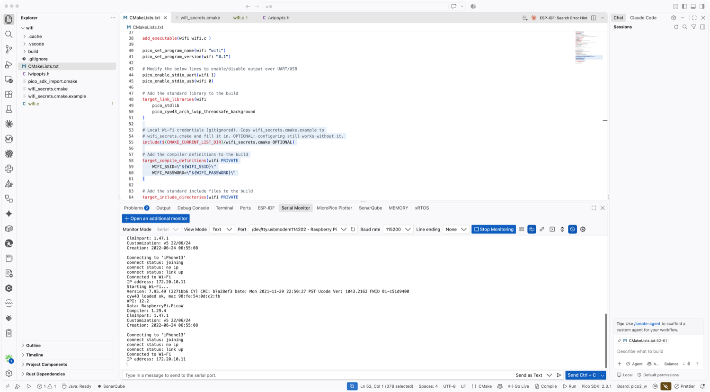

# Pico 2 W — `wifi`

Connects a Raspberry Pi Pico 2 W to a 2.4 GHz WPA2 network, prints the DHCP
address it receives, and blinks the onboard LED as a heartbeat.

Built on macOS with VS Code, the Raspberry Pi Pico extension, and a Raspberry Pi
Debug Probe. Everything below was verified on real hardware.

## Result



```txt
Starting Wi-Fi...
Version: 7.95.49 (2271bb6 CY) CRC: b7a28ef3 Date: Mon 2021-11-29 22:50:27 PST ...
cyw43 loaded ok, mac 98:fe:54:xx:xx:xx
API: 12.2
Data: RaspberryPi.PicoW
Compiler: 1.29.4
ClmImport: 1.47.1

Connecting to 'iPhone13'
connect status: joining
connect status: no ip
connect status: link up
Connected to Wi-Fi
IP address: 172.20.10.11
```

The `Version:`/`mac`/`API:` banner and the `connect status:` lines come from the
CYW43 driver itself, not from `wifi.c`. They are a useful progress indicator:

| Line | Meaning |
| --- | --- |
| `cyw43 loaded ok` | 225 KB of WiFi firmware uploaded to the CYW43439 over SPI |
| `connect status: joining` | association with the access point started |
| `connect status: no ip` | associated, waiting on DHCP |
| `connect status: link up` | DHCP lease granted — link is usable |

## Hardware

| Item | Detail |
| --- | --- |
| Board | Pico 2 W — RP2350, CYW43439 WiFi/BT |
| Radio | **2.4 GHz only** — no 5 GHz support |
| Probe | Raspberry Pi Debug Probe (CMSIS-DAP), `D` → debug header, `U` → GP0/GP1 |
| Console | `/dev/cu.usbmodem114202` @ 115200 via the probe's UART bridge |

## Project layout



```txt
rasp/wifi/
├── CMakeLists.txt              build definition
├── wifi.c                      the application
├── lwipopts.h                  lwIP configuration — REQUIRED, see below
├── wifi_secrets.cmake          your credentials — gitignored
├── wifi_secrets.cmake.example  template, committed
├── pico_sdk_import.cmake
├── .vscode/
└── build/                      generated
```

## Setup

### 1. Create the project

**Pico sidebar → New C/C++ Project.**

| Field | Value | Why |
| --- | --- | --- |
| Name | `wifi` | |
| **Board type** | **Pico 2 W** | **not "Pico 2"** — that board has no WiFi chip at all |
| RISC-V checkbox | unchecked | Arm has better debug tooling |
| SDK version | any installed version | a new version triggers a full download |
| Features | none | WiFi comes from the board choice, not this list |
| **Stdio support** | **Console over UART** | matches the probe's `U` connector; survives breakpoints |
| Console over USB | unchecked | USB output dies whenever a core halts |
| Debugger | DebugProbe (CMSIS-DAP) | |

Picking "Pico 2" instead of "Pico 2 W" is the single most common mistake. It
produces `set(PICO_BOARD pico2 ...)`, and then `pico/cyw43_arch.h` will not
resolve.

### 2. CMakeLists.txt — link the network stack

```cmake
target_link_libraries(wifi
    pico_stdlib
    pico_cyw43_arch_lwip_threadsafe_background
)

pico_enable_stdio_uart(wifi 1)
pico_enable_stdio_usb(wifi 0)
```

Choosing the right cyw43 variant:

| Library | Use |
| --- | --- |
| `..._none` | driver only, no TCP/IP — enough to reach the LED |
| `..._lwip_poll` | networking, you call `cyw43_arch_poll()` yourself |
| **`..._lwip_threadsafe_background`** | **networking on a background interrupt — use this** |
| `..._lwip_sys_freertos` | under FreeRTOS |

### 3. lwipopts.h — required, not optional

lwIP ships **no default configuration**. Every project must supply `lwipopts.h`
or the build fails with:

```
fatal error: lwipopts.h: No such file or directory
```

The project wizard generates one only when you select a W board. See
[lwipopts.h](lwipopts.h) in this project — it enables DHCP, TCP, UDP and DNS
with `NO_SYS=1`, which is what `threadsafe_background` requires.

### 4. Credentials — keep them out of git

Do **not** put your password in `wifi.c`. Commenting it out does not help either:
the text still lands in git history.

`CMakeLists.txt`:

```cmake
include(${CMAKE_CURRENT_LIST_DIR}/wifi_secrets.cmake OPTIONAL)

target_compile_definitions(wifi PRIVATE
    WIFI_SSID=\"${WIFI_SSID}\"
    WIFI_PASSWORD=\"${WIFI_PASSWORD}\"
)
```

`wifi_secrets.cmake` (gitignored):

```cmake
set(WIFI_SSID     "YourNetwork")
set(WIFI_PASSWORD "YourPassword")
```

`.gitignore`:

```gitignore
build/
wifi_secrets.cmake
.cache/
.DS_Store
```

`OPTIONAL` keeps the build configurable without the file. Because the secrets
live in a source file rather than the CMake cache, they survive `rm -rf build` —
which matters, because that is the standard recovery for a wedged cache.

An undefined CMake variable expands to **nothing**, silently producing
`-DWIFI_SSID=""`. Guard against it in `wifi.c`:

```c
if (WIFI_SSID[0] == '\0') {
    printf("ERROR: WIFI_SSID is empty.\n");
    printf("Set it in wifi_secrets.cmake, then delete build/ and reconfigure.\n");
    while (true) { sleep_ms(1000); }
}
```

Without this, an empty SSID looks identical to a failed connection: a 30-second
wait and error `-2`.

## Build and flash

From the IDE: **Compile Project**, then **Flash Project (SWD)**. Not "Run
Project (USB)" — that is the picotool route and needs the board in BOOTSEL mode.

From the terminal:

```bash
cd /1.unit-testing/wifi

# configure (only needed after changing board/architecture, or to recover)
~/.pico-sdk/cmake/v4.3.4/bin/cmake -B build -G Ninja \
  -DCMAKE_BUILD_TYPE=Debug -DPICO_BOARD=pico2_w -DPICO_PLATFORM=rp2350-arm-s .

# build
~/.pico-sdk/ninja/v1.13.2/ninja -C build

# flash through the Debug Probe
~/.pico-sdk/openocd/0.12.0+dev/openocd \
  -s ~/.pico-sdk/openocd/0.12.0+dev/scripts \
  -f interface/cmsis-dap.cfg -f target/rp2350.cfg \
  -c "adapter speed 5000" \
  -c "program build/wifi.elf verify reset exit"
```

Editing `wifi_secrets.cmake` triggers a reconfigure automatically — `ninja -C
build` alone is enough after a credential change.

Confirm credentials actually reached the compiler:

```bash
python3 -c "
import json
d=json.load(open('build/compile_commands.json'))
for e in d:
    if e['file'].endswith('wifi.c'):
        print([x for x in e['command'].split() if 'WIFI_' in x]); break
"
```

## Serial Monitor



**Panel → Serial Monitor**, then:

| Setting | Value |
| --- | --- |
| Port | `/dev/tty.usbmodem114202 - Raspberry Pi` |
| Baud rate | `115200` |
| Line ending | `None` |
| Monitor Mode | `Serial` |

Press **Start Monitoring**, then reset the board to see the boot output:

```bash
~/.pico-sdk/openocd/0.12.0+dev/openocd \
  -s ~/.pico-sdk/openocd/0.12.0+dev/scripts \
  -f interface/cmsis-dap.cfg -f target/rp2350.cfg \
  -c "adapter speed 5000" -c "init; reset run; exit"
```

**Only one program may hold a serial port.** If `screen`, `minicom` or another
monitor has it, the Serial Monitor reports `Failed to open the serial port` and
falls back to whatever else it can grab (`Bluetooth-Incoming-Port`,
`debug-console`). Find and release the holder:

```bash
lsof /dev/cu.usbmodem114202 /dev/tty.usbmodem114202
screen -ls
screen -X -S <pid> quit
```

Note that `/dev/cu.*` and `/dev/tty.*` are the same device and lock each other
out — `stty` reporting `Resource busy` while `lsof` on `cu.` shows nothing
usually means something holds the `tty.` node.

## Troubleshooting

| Symptom | Cause and fix |
| --- | --- |
| `fatal error: lwipopts.h: No such file` | no lwIP config — add `lwipopts.h` |
| `pico/cyw43_arch.h` not found | `PICO_BOARD` is `pico2`, not `pico2_w` |
| `Failed to connect to Wi-Fi: -2` | timeout — see below |
| `-DWIFI_SSID=\"\"` in the compile command | `wifi_secrets.cmake` missing or not included |
| `clang: error: unsupported argument 'armv8-m.main+fp+dsp'` | CMake cached the host compiler — see below |
| `ninja: error: loading 'CMakeFiles/rules.ninja'` | symptom of the above; `rm -rf build` |
| `Failed to open the serial port` | another program holds it |
| Nothing on the console | the firmware prints nothing, or `U` connector not wired |

### `-2` (PICO_ERROR_TIMEOUT)

Thirty seconds elapsed without association. In order of likelihood:

1. **The network is 5 GHz.** The CYW43439 has no 5 GHz radio, so the SSID is
   invisible — indistinguishable from a wrong password. On an iPhone hotspot:
   **Settings → Personal Hotspot → Maximize Compatibility → ON**, and keep that
   screen open while connecting. This was the cause here.
2. Wrong password.
3. Wrong auth constant — `CYW43_AUTH_WPA2_MIXED_PSK` is more permissive than
   `CYW43_AUTH_WPA2_AES_PSK`.
4. Country code restricting channels — try `CYW43_COUNTRY_WORLDWIDE`.

**WPA2-Enterprise (eduroam and most campus networks) is not supported.**
`cyw43_arch_wifi_connect_timeout_ms` only speaks WPA2-Personal with a
pre-shared key. Use a phone hotspot or a home network.

Returning `1` from `main()` on a Pico does not exit to anything — the runtime
restarts, so a failure produces a reboot loop in the console. That is expected,
not a crash.

### Host compiler in the CMake cache

CMake caches compiler paths on the first configure and never re-checks them, so
one stray configure by the CMake Tools extension with a host kit poisons
`build/` permanently:

```
CMAKE_C_COMPILER  /usr/bin/clang        ← wrong
CMAKE_ASM_COMPILER .../arm-none-eabi-gcc ← right
```

Diagnose — all three must name the same toolchain:

```bash
grep -E "^CMAKE_(C|CXX|ASM)_COMPILER:" build/CMakeCache.txt
```

Fix by deleting `build/` entirely; "Clean CMake" is not enough because it leaves
`CMakeCache.txt` behind. To stop it recurring, either select the **Pico** kit
(Cmd+Shift+P → *CMake: Select a Kit*) or disable the **CMake Tools** extension
for this workspace — the Pico extension does not need it.

## Next steps

- Scan for networks with `cyw43_wifi_scan` to see what the radio can actually
  see — the definitive test for the 5 GHz problem.
- Retry on failure instead of resetting.
- Open a TCP socket, fetch a URL, or serve a page over lwIP.
