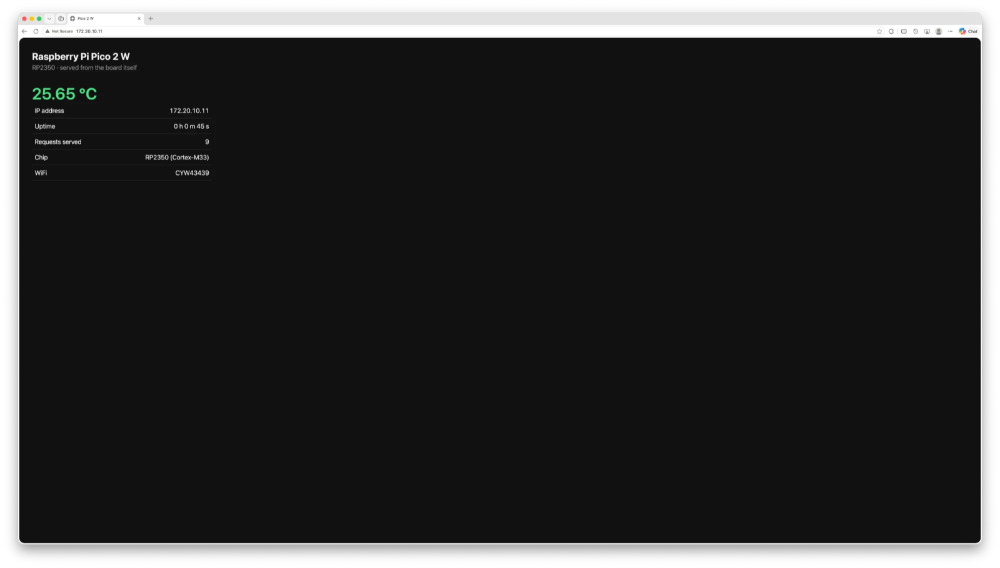

# Integration-level verification — Raspberry Pi Pico 2 W

Verification that independently-verified subsystems operate **together**,
following the **V-model**. This level tests against the architectural design:
the question is not whether each unit works — that was established at unit level
— but whether the interfaces between them are correct.

Unit-level verification is in [`../unit_testing/`](../unit_testing/) and is a
precondition for everything here. Every subsystem combined below carries a
recorded PASS at unit level.

## Test environment

| Item | Detail |
| --- | --- |
| Target | Raspberry Pi Pico 2 W — RP2350 rev 2, Cortex-M33, 4 MiB W25Q32 flash |
| Radio | CYW43439 — WiFi 2.4 GHz and Bluetooth |
| Debug probe | Raspberry Pi Debug Probe (CMSIS-DAP), firmware 1.0.1 |
| Console | Probe UART bridge, `/dev/cu.usbmodem114202`, 115200 8N1 |
| Network | 2.4 GHz WPA2, DHCP; test client on the same subnet |
| Toolchain | Pico SDK 2.3.1, arm-none-eabi-gcc 15.2.1, OpenOCD 0.12.0+dev |
| Build | `PICO_PLATFORM=rp2350-arm-s`, `CMAKE_BUILD_TYPE=Debug` (`-Og -g`) |

---

## IT-1 — `webserver` — WiFi + lwIP + TCP + ADC + HTTP

**Objective.** Verify that the board joins a network, accepts TCP connections,
samples the ADC while handling a request, and returns a well-formed HTTP
response — that is, that four separately-verified subsystems compose correctly.

### Units integrated

| Unit | Verified at | Role here |
| --- | --- | --- |
| WiFi + lwIP | UT-3 | network attachment, DHCP address |
| ADC | UT-2 | temperature sampled per request |
| GPIO via CYW43 | UT-1 | heartbeat LED |
| — | — | TCP listener and HTTP response builder (new at this level) |

### Interfaces under test

This is what distinguishes integration from a larger unit test. Each item below
is a seam between two components, and each can fail while both sides are
individually correct.

| # | Interface | Between | Failure mode if wrong |
| --- | --- | --- | --- |
| I1 | DHCP address → server bind | WiFi stack → TCP listener | server binds before an address exists; unreachable |
| I2 | ADC sample → HTTP body | ADC driver → response builder | stale or garbled temperature in the page |
| I3 | lwIP background IRQ → TCP callbacks | CYW43 driver → application | callbacks never fire; connections hang |
| I4 | `Content-Length` → transmitted body | response builder → TCP send path | truncated body; **renders correctly in a browser** |
| I5 | ADC sampling ↔ network servicing | ADC → lwIP timing | blocking sample starves the network stack |

### Procedure

1. Connect to WiFi and obtain a DHCP address.
2. Bind a TCP listener on port 80 and register accept/recv/sent/err callbacks.
3. On each request, sample the ADC, build an HTTP response with an explicit
   `Content-Length`, and transmit it.
4. Request the page from a browser on the same network.
5. Request it independently with `curl`, capturing headers and measuring the
   actual body length.
6. Read the request counter directly off the target with GDB.

### Expected result

- `HTTP/1.1 200 OK`
- Received body length **exactly equal** to the declared `Content-Length`
- Temperature consistent with UT-2
- Request counter incrementing once per request

### Observed result

Browser — the page renders with live values:



Independent fetch with `curl` from a host on the same network:

```txt
$ curl -D - http://172.20.10.11/

HTTP/1.1 200 OK
Content-Type: text/html; charset=utf-8
Content-Length: 991
Connection: close
```

Body measured **exactly 991 bytes** against the declared 991.

Content of that response:

```txt
25.73 degC
IP address        172.20.10.11
Uptime            0 h 1 m 19 s
Requests served   23
Chip              RP2350 (Cortex-M33)
WiFi              CYW43439
```

Request counter read from the target afterwards, having advanced further
through the page's own 5 s auto-refresh:

```txt
(gdb) print request_count
$1 = 29
```

### Verdict: PASS

See [webserver/README.md](webserver/README.md).

### Interface results

| # | Interface | Evidence | Result |
| --- | --- | --- | --- |
| I1 | DHCP → bind | server reachable at the DHCP-assigned 172.20.10.11 | PASS |
| I2 | ADC → HTTP body | 25.73 degC in the response, consistent with UT-2 | PASS |
| I3 | lwIP IRQ → callbacks | 29 requests served without intervention from `main()` | PASS |
| I4 | `Content-Length` → body | declared 991, measured 991 | PASS |
| I5 | ADC ↔ network timing | repeated auto-refresh served without stalling | PASS |

### Why I4 is the significant assertion

Matching declared and actual body lengths proves the connection is closed only
after all data has been acknowledged.

The natural mistake is to call `tcp_close()` in the receive callback, right
after `tcp_write()`. That discards unacknowledged bytes. The resulting page is
short — but browsers are tolerant of a truncated body and **render it correctly
anyway**. The fault is therefore invisible to visual inspection, and the
browser screenshot alone would not have detected it.

Only measuring the response catches it. This is the concrete argument for why
integration verification needs an instrument rather than an observer.

### Temperature cross-check

The served 25.73 degC is consistent with UT-2's 27.23 degC. The difference
reflects genuine die cooling between runs, not an error in the integration
path — the conversion is identical code in both projects.

---

## Summary

| ID | Project | Subsystems integrated | Key measurement | Verdict |
| --- | --- | --- | --- | --- |
| IT-1 | `webserver` | WiFi + lwIP + TCP + ADC + HTTP | 200 OK, 991/991 bytes, 29 requests | PASS |

The integrated binary is only ~9 KB larger than the WiFi unit alone: the TCP
server and ADC sampling add little, because the dominant cost in all of them is
the CYW43439 firmware blob and lwIP, which are already present.

`text` is code and constants, stored in flash. `bss` is zero-initialised globals
— RAM only, costing no flash. The ~48 KB of `bss` in both `wifi` and
`webserver` is almost entirely lwIP's packet buffer pool
(`memp_memory_PBUF_POOL_base`, 36,771 bytes), set by `PBUF_POOL_SIZE` in
`lwipopts.h`. Integration therefore adds almost no RAM here: the pool was
already reserved by the WiFi unit. See
[`../unit_testing/README.md`](../unit_testing/README.md) for the full breakdown.

## Defects found during integration verification

| # | Defect | Root cause | Resolution |
| --- | --- | --- | --- |
| 1 | Board unreachable from the test client | Client and board were on different networks — a device on a phone hotspot is not routable from a laptop on another WiFi network | Join the test client to the same network |
| 2 | No DHCP address (`ip_addr = 0x0`) | Access point was not running | Start the access point; re-verify before testing |

Neither is a fault in the integrated software. Both are test-setup faults, and
both are worth recording because they present as product failures.

## Method notes

**Two independent observations.** The result was confirmed both by a browser
rendering the page and by `curl` measuring the response. The first demonstrates
the user-visible outcome; the second provides a numeric assertion. Neither alone
is sufficient — see the note on I4 above.

**Target-side confirmation.** The request counter was read directly from the
running target, confirming the board itself recorded the requests rather than
the result being inferred solely from the client side.

**Reading the address without the console:**

```bash
~/.pico-sdk/toolchain/15_2_Rel1/bin/arm-none-eabi-gdb build/webserver.elf -q -batch \
  -ex "target extended-remote 127.0.0.1:3333" -ex "monitor halt" \
  -ex "print/x netif_default->ip_addr.addr" -ex "print request_count"
```

`0x0` means DHCP has not completed. The address is little-endian, so
`0xb0a14ac` is `172.20.10.11`. Note that halting the target suspends the server
— resume with `monitor reset init` or a `reset run` afterwards.

**Not automated.** These are manual verification procedures with recorded
evidence. The `curl` check is the natural candidate for automation:

```bash
curl -sf -D /tmp/h http://172.20.10.11/ -o /tmp/b \
  && [ "$(grep -i content-length /tmp/h | tr -dc 0-9)" = "$(wc -c < /tmp/b)" ] \
  && echo PASS || echo FAIL
```
