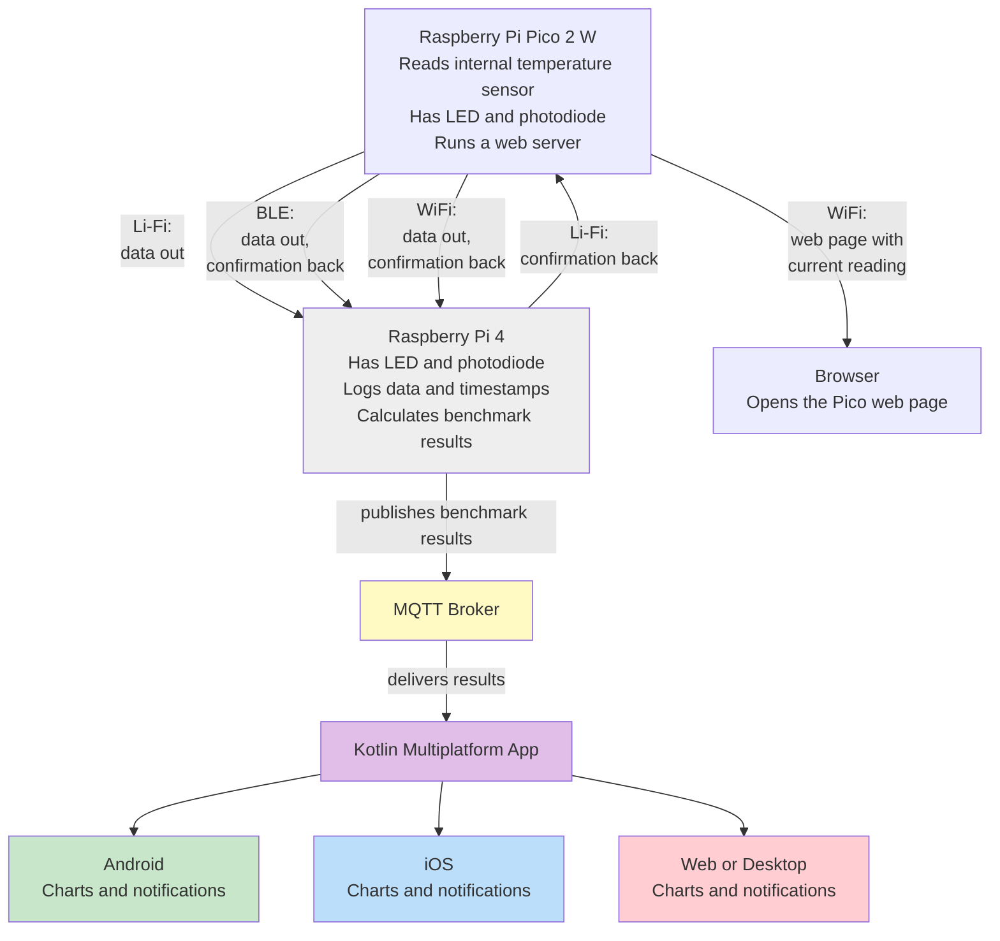

# Comparing Bluetooth, Li-Fi and Wi-fi for Sending Sensor Data

> Student name: Van Dung Phan
>
> Student number: 546821
>
> Student Email: [546821@student.saxion.nl](mailto:546821@student.saxion.nl)
>
> Email: [dungpv.294@gmail.com](mailto:dungpv.294@gmail.com)
>
> Supervisor: Mr. Christian Slot — Saxion University of Applied Sciences

## Introduction

This project builds and benchmarks three wireless methods for sending sensor data from a **Raspberry Pi Pico 2 W** to a **Raspberry Pi 4**: **Li-Fi** (light, via LED/photodiode), **Bluetooth Low Energy (BLE)**, and **Wi-Fi**. The same sensor reading — the Pico's internal temperature — is sent through all three methods at the same time, enabling a direct, measured comparison of throughput, range, reliability (bit error rate), latency, and power use, including behavior under interference.

**Research question:** Under which conditions of distance, interference, and obstruction does each of Li-Fi, BLE, and Wi-Fi perform best for sending sensor data, based on throughput, range, reliability, latency, and power use?

## System Overview

1. The Pico reads its internal temperature sensor and transmits the same value simultaneously over Li-Fi, BLE, and Wi-Fi.
2. Each method is a full round trip: the Pi 4 sends a confirmation back over the *same* channel it received data on (including a return light path for Li-Fi).
3. The Pi 4 timestamps and logs incoming data and calculates benchmark results (throughput, reliability, latency, power).
4. Results are published via **MQTT** to a **Kotlin Multiplatform (KMP)** app, which shows live data and benchmarks with native charts and notifications on Android, iOS, and Web/Desktop.
5. The Pico also runs its own lightweight web server (over Wi-Fi) so the current reading can be checked directly from the device, independent of the app — a sanity check that the full pipeline reports correct, real-time values.

Because Wi-Fi, BLE, and Li-Fi run simultaneously for the main comparison, temperature rise can't be attributed to a single method there. So a **separate, isolated test** runs each method on its own (the other two idle) to cleanly attribute temperature/power changes to that one method, cross-checked against INA219 power readings.

## Why This Project

Wi-Fi and BLE are common, well-understood choices for sensor data. Li-Fi is far less common in student projects but has real industrial relevance — e.g., hospitals, aircraft, or other settings where radio signals are restricted, or where a light-confined signal offers better protection against interference or interception. Rather than relying on literature claims, this project measures the differences directly.

- **Electrical engineering side:** analog photodiode receiver design (transimpedance amplifier + comparator), firmware for optical encoding/decoding (OOK), BLE/Wi-Fi radio configuration, and a controlled interference test methodology.
- **Computer science side:** a real Kotlin Multiplatform architecture decision, a live data-aggregation/benchmarking pipeline, and a working cross-platform dashboard.

Li-Fi is not positioned as a Wi-Fi replacement — its need for a clear light path and shorter range make it suited to specific situations, which the report studies directly.

## Deliverables

- A sensor node sending the same internal temperature reading over Li-Fi, BLE, and Wi-Fi simultaneously
- A two-way Li-Fi link (LED + photodiode circuits with transimpedance amplifier and comparator stage on both the Pico and Pi 4 sides)
- A confirmation mechanism for all three methods, echoed back over the same channel that carried the original reading
- A Pi 4 pipeline that aggregates, timestamps, benchmarks, and publishes results via MQTT
- A Pico-hosted web server for independent, real-time verification of the current reading
- A Kotlin Multiplatform app with shared logic/state and native charts/notifications per platform
- A benchmark data set and analysis (throughput, range, reliability, latency, power via INA219), including interference from radio congestion, ambient light, and blocked light paths
- A per-method comparison of internal temperature rise vs. INA219 power readings
- A final report with source code, firmware, circuit schematics, and full analysis
- A presentation with a live demonstration, including live interference tests

## Key Terms

| Term | Meaning |
| --- | --- |
| Li-Fi | Sends data through light using a LED (transmitter) and photodiode (receiver) |
| Wi-Fi | Wireless method sending data via radio waves, commonly used for internet access |
| BLE | Bluetooth Low Energy — short-range, low-power radio communication |
| MQTT | Lightweight messaging protocol for sending sensor data between devices |
| KMP | Kotlin Multiplatform — shared code across Android, iOS, web, and desktop |
| OOK | On-Off Keying — sending data by switching a signal (e.g. light) on/off |
| BER | Bit Error Rate — proportion of bits received incorrectly |
| INA219 | Sensor chip used to measure voltage/current (power use) |

See the full [Project Idea document](document/%5B546821-%20Van%20Dung%20Phan%5D%20Capita%20Selecta%20-%20Project%20Idea.pdf) for the complete assignment description, argumentation, component list, and hour breakdown.

## Project Details

- **Duration:** Half a year (10 EC module, 280 hours)
- **Supervisor:** Mr. Christian Slot
- **Institution:** Saxion University of Applied Sciences
